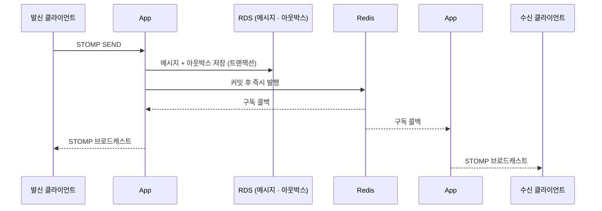
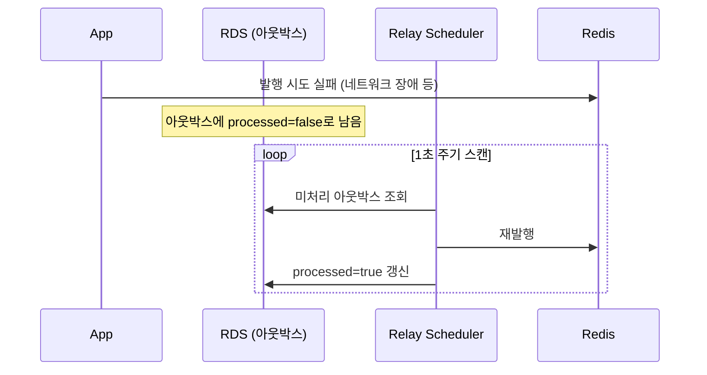
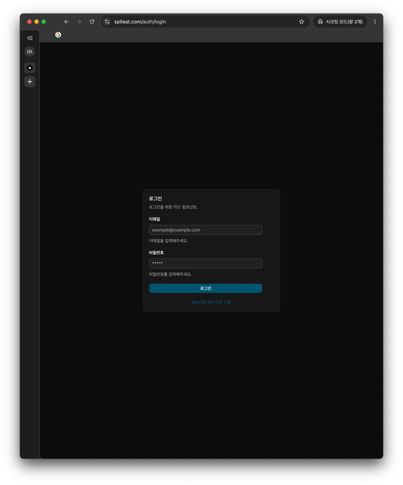
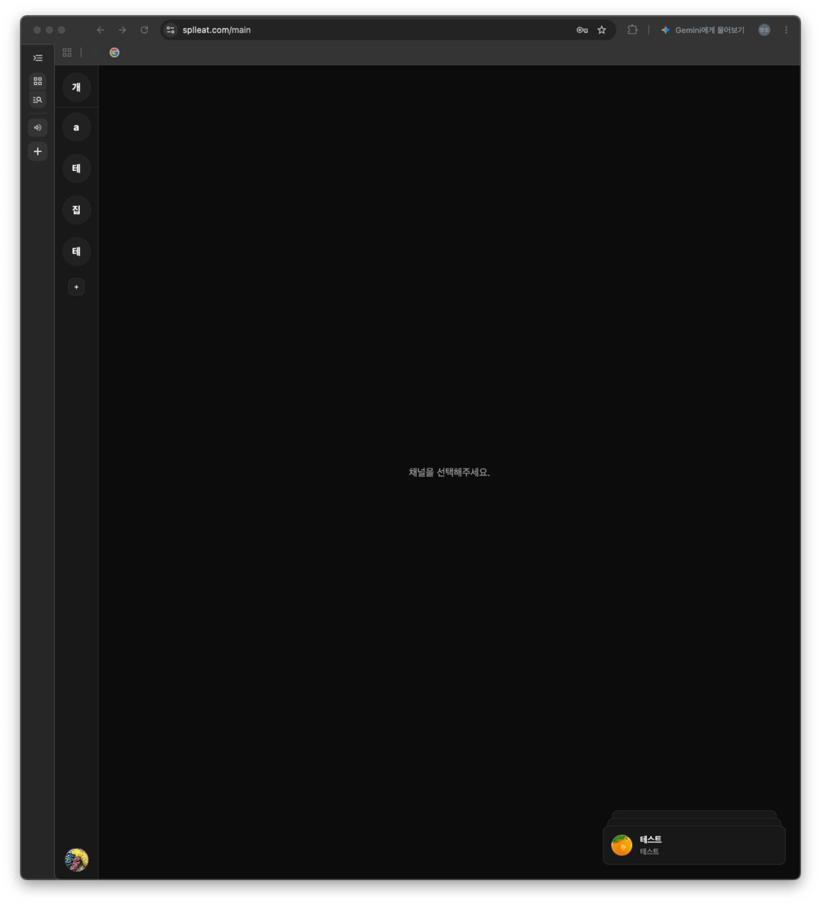
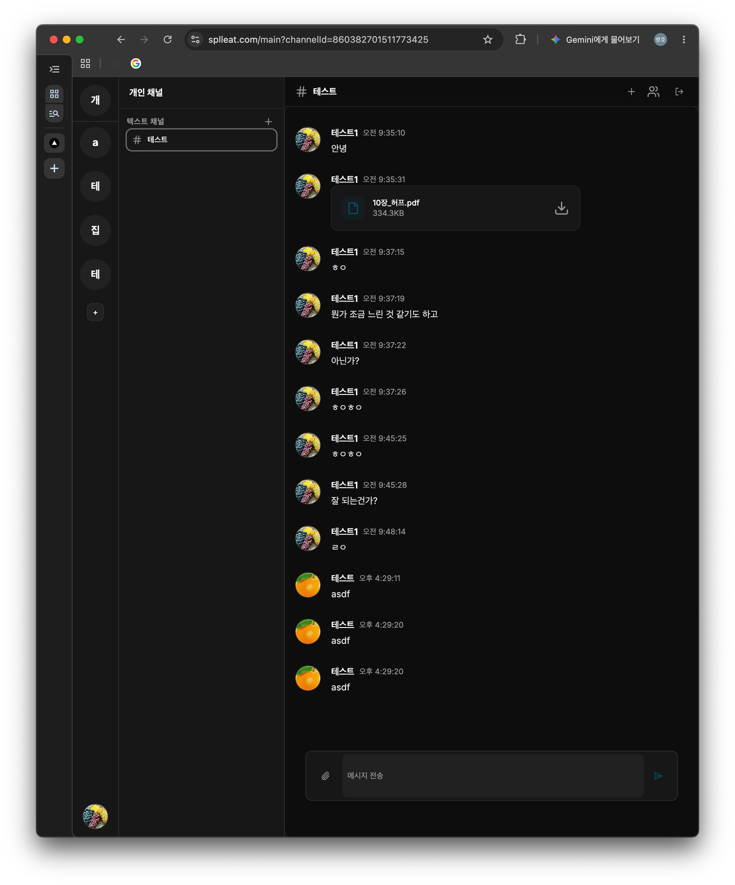
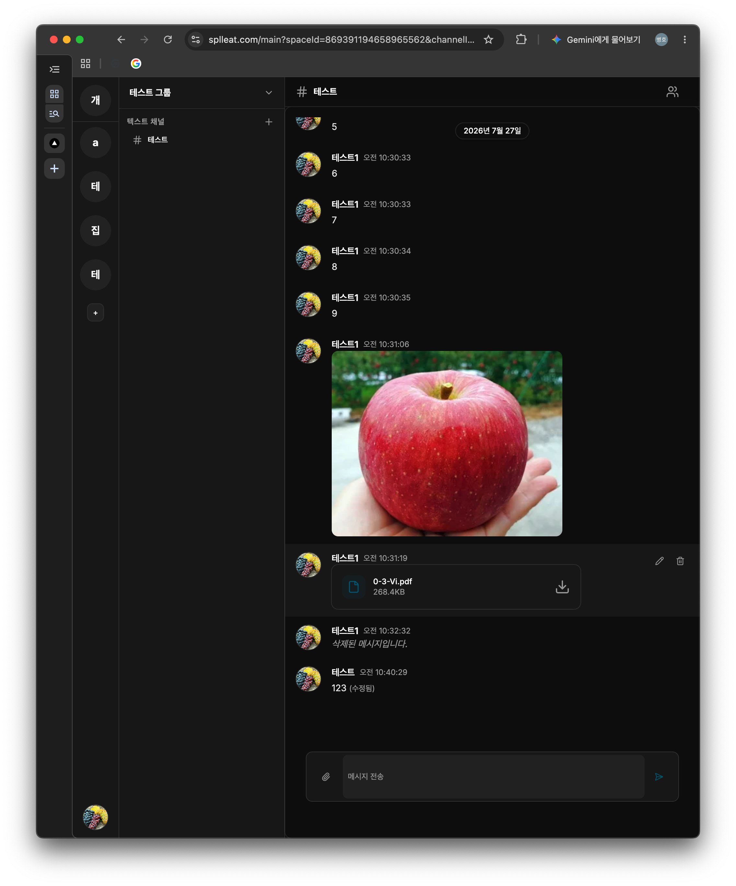
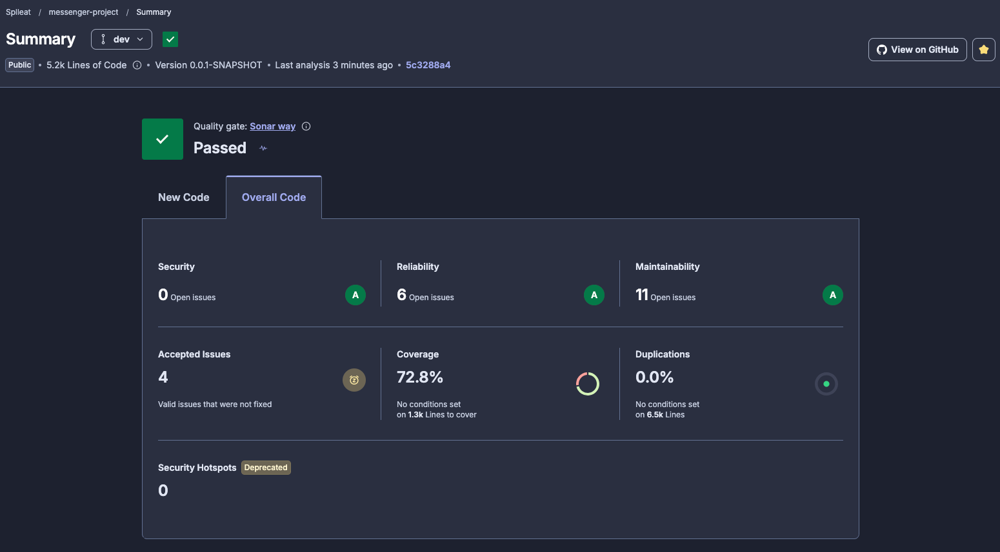

# Messenger

스페이스/채널 기반의 실시간 메신저 서비스입니다. STOMP 웹소켓으로 메시지를 주고받고, 파일 첨부를 지원합니다.

실시간성, 동시성, 트랜잭션, 데이터 모델링 등 백엔드 시스템의 핵심적인 문제를 종합적으로 다루기 위해 메신저 도메인을 선정했습니다.

메시지 저장과 발행의 원자성을 Outbox 패턴으로 보장하고, TSID 기반 커서 페이징과 Redis Pub/Sub 다중 인스턴스 브로드캐스트를 설계했습니다.

**데모: [www.splleat.com](https://www.splleat.com)** · **API 문서: [Swagger](https://api.splleat.com/swagger-ui/index.html)** · **프론트엔드: [Messenger-Front](https://github.com/Splleat/Messenger-Front)**

---

## 기술 스택


---

## 아키텍처


- EC2 인스턴스는 t3.micro(메모리 1GB)로 운영합니다. DB와 파일 스토리지를 EC2에 함께 구성하면 애플리케이션에 사용할 메모리가 부족해질 수 있어 RDS와 S3로 분리했습니다.
- Redis Pub/Sub은 실시간 브로드캐스트 용도로만 사용됩니다. 모든 메시지 데이터는 DB를 기준으로 처리합니다.
- Redis 발행 실패에 대비해 Outbox 이벤트를 DB에 함께 저장하고, 보정 스케줄러를 통해 2 ~ 60초 이전에 생성된 미발행 이벤트를 재처리합니다.

### 실시간 메시지 전달 흐름

메시지는 DB에 아웃박스로 저장된 뒤 Redis Pub/Sub으로 발행되고, 채널을 구독 중인 모든 애플리케이션 인스턴스가 받아 연결된 클라이언트에게 STOMP로 브로드캐스트합니다.

#### 정상 흐름



#### 재시도 흐름



- Redis Pub/Sub은 실시간 브로드캐스트만 담당합니다. 메시지 자체는 이미 DB에 커밋되어 있으므로, 발행이 실패해도 메시지가 유실되지는 않습니다. 수신자가 실시간으로 받지 못할 뿐, 채널 재진입 시 DB를 기준으로 수행되는 커서 기반 페이징으로 정상 조회됩니다.
- 정상 처리 중인 메시지를 재시도하지 않기 위해, 생성된 지 2초 이상 지난 미처리 건만 재시도 대상으로 합니다. 재시도 지연은 최소 2~3초(유예 시간 + 스케줄러 주기)부터, 최대 60초까지입니다.
- 60초가 지나도 미처리 상태인 이벤트는 재시도 윈도우에서 제외됩니다. 이 경우 실시간 브로드캐스트는 전달되지 않을 수 있지만, 메시지 자체는 DB에 저장되어 있어 채널 재진입 시 조회할 수 있습니다.

---

## 주요 기능

- **인증**: 회원가입 / 로그인 / 로그아웃, JWT(Access/Refresh) 기반 인증, 토큰 재발급 및 블랙리스트 로그아웃
- **스페이스 · 채널**: 스페이스 생성·초대·탈퇴, 1:1(다이렉트) / 그룹 채널
- **실시간 메시징**: STOMP 웹소켓 기반 송수신, Redis Pub/Sub로 인스턴스 간 메시지 전파
- **메시지 신뢰성**: 메시지와 Outbox 이벤트를 하나의 트랜잭션으로 저장하고, Redis 발행 실패 시 복구 스케줄러를 통해 재처리
- **파일 첨부**: S3 presigned URL을 통한 브라우저 직접 업로드, 업로드 이전 크기 / 타입 검증
- **조회**: 커서 기반 양방향 페이징(무한 스크롤), 채널 재진입 시 마지막으로 읽은 메시지 기준 이전 / 이후 메시지 조회

---

## 스크린샷

| 로그인                        | 알림                             |
|----------------------------|--------------------------------|
|  |  |

| 개인 채널                                | 그룹 채널                              |
|--------------------------------------|-------------------------------------|
|  |   |

---

## 기술적 의사결정

설계하며 마주친 문제와 선택의 근거를 문서로 정리했습니다.

1. **[JWT는 정말로 Stateless한가?](docs/01-jwt-stateless.md)** — 로그아웃·토큰 무효화를 위한 Refresh/블랙리스트 설계 과정
2. **[TSID를 도입하며 만난 예상치 못한 문제들](docs/02-db-pk.md)** — 분산 환경 PK 전략과 트레이드오프
3. **[커서 기반 양방향 페이징 설계](docs/03-paging-strategy.md)** — 무한 스크롤을 위한 커서 기반 페이징

추가로 적용한 패턴:

- **아웃박스 패턴** — 메시지 저장과 Outbox 저장을 하나의 트랜잭션으로 처리하고, 발행 실패 이벤트를 스케줄러로 재처리.
- **분산 락(Redisson)** — 다중 인스턴스 환경에서 Outbox Relay 작업의 중복 실행을 방지하기 위해 Redisson 기반 분산 락 적용.
- **환경별 스토리지 추상화** — 동일한 S3 SDK 코드로 로컬은 MinIO, 운영은 AWS S3.

---

## 배포

| 구성 요소                 | 환경                                                        |
|-----------------------|-----------------------------------------------------------|
| 프론트엔드                 | **Vercel** (Next.js, 자동 HTTPS · CI/CD)                    |
| 백엔드 · Redis · 리버스 프록시 | **AWS EC2** — `docker compose`로 `Caddy + App + Redis` 구동  |
| 데이터베이스                | **AWS RDS** (MySQL)                                       |
| 파일 스토리지               | **AWS S3** (EC2 IAM 롤로 Keyless 접근)                        |
| HTTPS                 | **Caddy** 자동 발급(Let's Encrypt) / Vercel 자동                |
| CI                    | **GitHub Actions** — push / PR 시 빌드 + 테스트(Testcontainers) |

- 운영 구성은 [`compose.prod.yaml`](compose.prod.yaml), 리버스 프록시는 [`Caddyfile`](Caddyfile) 참고.
- 로컬은 MinIO·MySQL 컨테이너, 운영은 관리형 S3·RDS를 사용하도록 프로파일·환경변수로 분리.

---

## 코드 품질



GitHub Actions에서 빌드 및 테스트 통과 후 SonarCloud로 정적 분석을 수행합니다.

---

## ERD


---

## 도메인 구조

도메인 / 애플리케이션 / 인터페이스 / 인프라 계층을 분리해 비즈니스 로직과 외부 기술 의존성을 분리했습니다.

```text
src/main/java/me/splleat/messengerproject/
├── domain/          # 도메인 모델
├── application/     # 비즈니스 유스케이스
├── interfaces/      # REST / WebSocket 진입점
├── infrastructure/  # JPA / Redis / S3 / Security 등 인프라
└── common/          # 공통 설정 및 예외 처리
```
