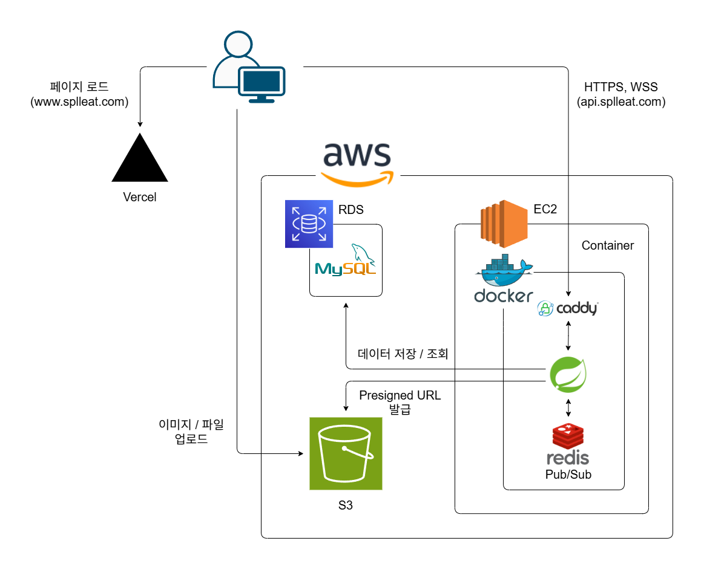
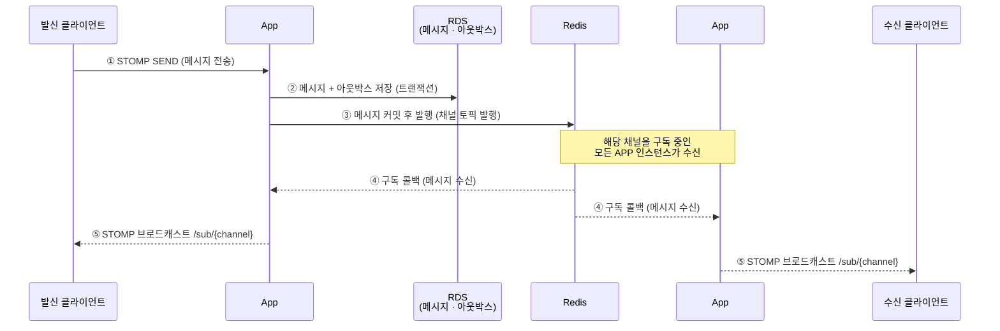
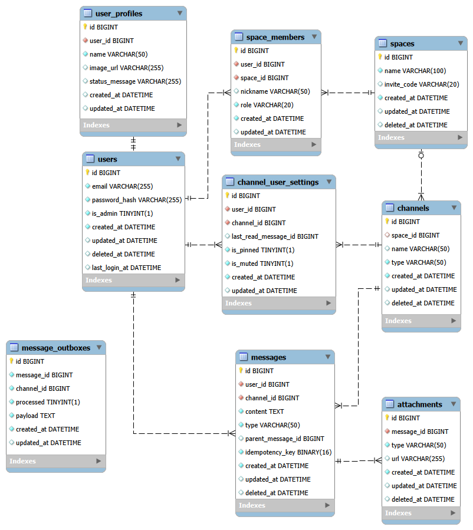

# Messenger

스페이스 · 채널 기반의 실시간 메신저 서비스. STOMP 웹소켓으로 메시지를 주고받고, 파일 첨부를 지원합니다.

**데모: [www.splleat.com](https://www.splleat.com)** · **API 문서: [Swagger](https://api.splleat.com/swagger-ui/index.html)** · **프론트엔드: [Messenger-Front](https://github.com/Splleat/Messenger-Front)**

---

## 기술 스택


---

## 아키텍처



- **상태가 있고 손실이 치명적인 데이터**(DB·파일)는 관리형 서비스(RDS·S3)로 분리해 내구성과 운영 부담을 위임했습니다.
- **휘발성 데이터**(Pub/Sub·락)를 다루는 Redis는 컨테이너로 운영합니다. 메시지는 아웃박스 패턴으로 DB에 안전하게 저장되므로 Redis 유실이 데이터 손실로 이어지지 않습니다.

### 실시간 메시지 전달 흐름

메시지는 DB에 아웃박스로 저장된 뒤 Redis Pub/Sub으로 발행되고, 채널을 구독 중인 모든 애플리케이션 인스턴스가 받아 자신에게 연결된 클라이언트에게 STOMP로 브로드캐스트합니다.



---

## 주요 기능

- **인증**: 회원가입 / 로그인 / 로그아웃, JWT(Access·Refresh) 기반 인증, 토큰 재발급 및 블랙리스트 로그아웃
- **스페이스 · 채널**: 스페이스 생성·초대·탈퇴, 1:1(다이렉트) / 그룹 채널, 채널별 사용자 설정
- **실시간 메시징**: STOMP 웹소켓 기반 송수신, Redis Pub/Sub로 인스턴스 간 메시지 전파
- **메시지 신뢰성**: 아웃박스 패턴 + 복구 스케줄러로 발행 실패 메시지 재처리
- **파일 첨부**: S3 presigned URL을 통한 브라우저 직접 업로드, 크기·타입 검증
- **조회**: 커서 기반 양방향 페이징(무한 스크롤), 읽음 처리

---

## 기술적 의사결정

설계하며 마주친 문제와 선택의 근거를 글로 정리했습니다.

1. **[JWT는 정말로 Stateless한가?](docs/01-jwt-stateless.md)** — 로그아웃·토큰 무효화를 위한 Refresh/블랙리스트 설계
2. **[TSID를 도입하며 만난 예상치 못한 문제들](docs/02-db-pk.md)** — 분산 환경 PK 전략과 트레이드오프
3. **[커서 기반 양방향 페이징 설계](docs/03-paging-strategy.md)** — 무한 스크롤을 위한 커서 페이징

추가로 적용한 패턴:

- **아웃박스 패턴** — 메시지 DB 커밋과 Pub/Sub 발행의 정합성 보장, 실패 메시지 스케줄러 복구.
- **분산 락(Redisson)** — 동시성이 필요한 작업을 `@DistributedLock` AOP + SpEL 동적 키로 처리.
- **환경별 스토리지 추상화** — 동일한 S3 SDK 코드로 로컬은 MinIO, 운영은 AWS S3.

---

## 배포

| 구성 요소 | 환경                                                      |
|---|---------------------------------------------------------|
| 프론트엔드 | **Vercel** (Next.js, 자동 HTTPS · CI/CD)                  |
| 백엔드 · Redis · 리버스 프록시 | **AWS EC2** — `docker compose`로 `Caddy + App + Redis` 구동 |
| 데이터베이스 | **AWS RDS** (MySQL)                                     |
| 파일 스토리지 | **AWS S3** (EC2 IAM 롤로 Keyless 접근)                      |
| HTTPS | **Caddy** 자동 발급(Let's Encrypt) / Vercel 자동              |
| CI | **GitHub Actions** — push·PR 시 빌드 + 테스트(Testcontainers) |

- 운영 구성은 [`docker-compose.prod.yml`](docker-compose.prod.yml), 리버스 프록시는 [`Caddyfile`](Caddyfile) 참고.
- 로컬은 MinIO·MySQL 컨테이너, 운영은 관리형 S3·RDS를 사용하도록 프로파일·환경변수로 분리.

---

## ERD



---

## 도메인 구조

```text
src/main/java/me/splleat/messengerproject/
├── domain/                    # 도메인 모델 및 도메인 서비스
│   ├── user/                  # 사용자(User), 사용자 프로필(UserProfile)
│   ├── space/                 # 스페이스(Space), 스페이스 멤버(SpaceMember), 권한(SpaceRole)
│   ├── channel/               # 채널(Channel), 채널 설정(ChannelUserSetting)
│   └── message/               # 메시지(Message), 첨부 파일(Attachment)
│
├── application/               # 비즈니스 유스케이스 레이어
│   ├── auth/                  # 회원가입, 로그인, 로그아웃, 토큰 재발급 유스케이스
│   ├── space/                 # 스페이스 생성, 조회, 초대, 탈퇴 유스케이스
│   ├── channel/               # 채널 생성, 조회, 읽음 처리 유스케이스
│   ├── message/               # 메시지 송신 유스케이스
│   └── profile/               # 프로필 조회, 수정, 이미지 변경 유스케이스
│
├── interfaces/                # 외부 클라이언트 진입점
│   ├── rest/                  # REST API 컨트롤러 (인증, 스페이스, 채널, 첨부, 프로필)
│   └── websocket/             # STOMP 기반 실시간 웹소켓 컨트롤러
│
├── infrastructure/            # 인프라 기술 및 프레임워크 연동
│   ├── message/               # 실시간 메시지 전달 및 발행 신뢰성 보장
│   │   ├── outbox/            # 아웃박스 패턴 (메시지 발행 보장)
│   │   ├── publisher/         # Redis Pub/Sub 발행
│   │   ├── subscriber/        # Redis 구독 → STOMP 라우팅
│   │   └── relay/             # 발행 실패 메시지 복구 스케줄러
│   ├── persistence/           # 영속성 계층
│   │   ├── entity/            # 공통 추상 엔티티 (BaseEntity, SoftDeletableEntity)
│   │   ├── jpa/               # Spring Data JPA
│   │   └── querydsl/          # QueryDSL
│   ├── security/              # Spring Security 및 JWT 필터/토큰 검증
│   ├── storage/               # S3/MinIO 스토리지 (presigned URL 발급, 파일 검증)
│   └── websocket/             # STOMP 메시지 핸들러 및 웹소켓 세션 인증 리졸버
│
└── common/                    # 프로젝트 전역 공통 설정 및 예외 처리
    ├── annotation/            # 커스텀 어노테이션 (@UseCase, @DistributedLock)
    ├── aop/                   # 분산 락 AOP (DistributedLockAspect)
    ├── config/                # Redis, S3, Security, WebSocket 등 설정 클래스
    ├── exception/             # 커스텀 비즈니스 예외 및 GlobalExceptionHandler, 공통 에러 응답
    └── util/                  # SpEL 동적 Lock Key 파서, 스토리지 URL 매퍼
```
